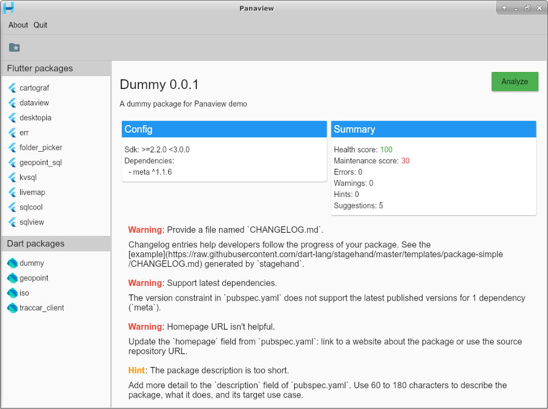

# Panaview

Desktop application to visualize Dart packages analysis. Runs [pana](https://pub.dev/packages/pana) and displays the results.

Uses [go-flutter](https://github.com/go-flutter-desktop/go-flutter) to build the desktop app. Use the binary release to run it for Linux:

```bash
git clone https://github.com/synw/panaview.git
cd panaview/bin
unzip panaview_linux.zip
cd linux
./panaview
```

Or run with [hover](https://github.com/go-flutter-desktop/hover):

```bash
git clone https://github.com/synw/panaview.git
cd panaview
hover run
```


